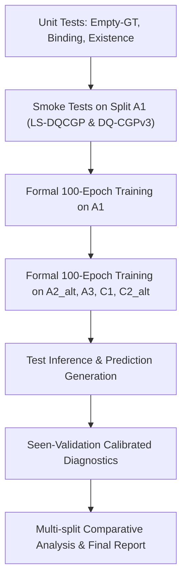

# Experiment Plan: DQ-CGP Semantic Generalization on Moment-DETR-GMR

## 1. Core Research Question

> **In the exact semantic novelty × event existence protocol on Charades-STA, does equipping Moment-DETR-GMR with DQ-CGP (LS-DQCGP or DQ-CGPv3) mitigate or reverse the observed seen-to-unseen degradation?**

---

## 2. Frozen Hyperparameter Specification

Neither method's hyperparameters may be tuned or adjusted based on Unseen ($U^+/U^-$) validation or test performance. The parameters are frozen as authored in upstream DQ-CGP:

### Method 1: LS-DQCGP
- `num_basis = 16`
- `prompt_length = 6`
- `router_hidden_dim = 256`
- `frf_hidden_dim = 512`
- `temperature = 1.0`
- `native_bind_coef = 0.2`
- `use_exist_head = True`
- `mr_only = True`
- `lw_saliency = 0`

### Method 2: DQ-CGPv3
- `query_cgp_num_basis = 16`
- `query_cgp_prompt_length = 6`
- `query_cgp_router_hidden_dim = 256`
- `query_cgp_frf_hidden_dim = 512`
- `query_cgp_temperature = 1.0`
- `query_cgp_beta = 0.05`
- `query_cgp_binding_loss_coef = 0.2`
- `query_cgp_route_loss_coef = 0.01`
- `use_exist_head = True`
- `mr_only = True`
- `lw_saliency = 0`

### Shared Protocol Parameters
- `seed = 3407`
- `n_epoch = 100`
- `max_es_cnt = -1` (no early stopping)
- `bsz = 16`, `eval_bsz = 16`
- `lr = 1e-4`, `lr_drop = 400`, `wd = 1e-4`
- Optimizer: AdamW, StepLR scheduler

---

## 3. Experiment Matrix (10 Runs)

| Split | Description | Holdout Semantics | LS-DQCGP (Seed 3407) | DQ-CGPv3 (Seed 3407) | Existing Moment Baseline |
| :--- | :--- | :--- | :---: | :---: | :---: |
| **A1** | Action | `put` / `take` | Run 1 | Run 6 | Completed |
| **A2_alt** | Action | `drink` / `pour` | Run 2 | Run 7 | Completed |
| **A3** | Action | `run` / `walk` | Run 3 | Run 8 | Completed |
| **C1** | Composition | `sit \| bed/chair/couch` | Run 4 | Run 9 | Completed |
| **C2_alt** | Composition | `open/close \| box/cabinet` | Run 5 | Run 10 | Completed |

---

## 4. Execution Workflow

1. **Unit Testing**:
   - Forward pass on pure $S^+$ batch
   - Forward pass on pure $S^-$ empty-GT batch
   - Forward pass on mixed $S^+/S^-$ batch
   - Backward pass and gradient checking (no NaN/Inf)
   - Hungarian matcher verification on empty GT
   - Verify `pred_exist_score`, `pred_relevant_windows_pre_exist`, and `pred_relevant_windows`

2. **A1 Smoke Testing**:
   - Short training step on split A1 for LS-DQCGP and DQ-CGPv3
   - Verify evaluation logging, checkpoint saving, and test inference pipeline

3. **Formal Training Pipeline**:
   - Train 10 full runs (5 splits × 2 methods) across GPU 0 and GPU 1
   - Best checkpoint selection strictly based on seen-validation mAP (`val_seen.jsonl`)

4. **Evaluation & Diagnostics**:
   - Run inference on full `test.jsonl`
   - Run `scripts/analyze_semantic_existence.py` to extract 4-quadrant metrics, AUROC, AUROC gap, matched-pair accuracy, and raw vs. gated localization
   - Calculate action-axis equal-weight means, composition-axis equal-weight means, and overall statistics
